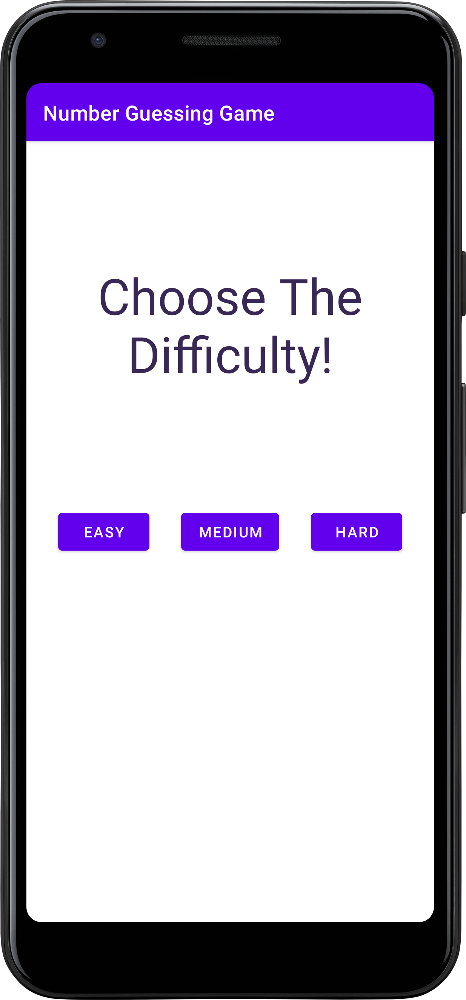
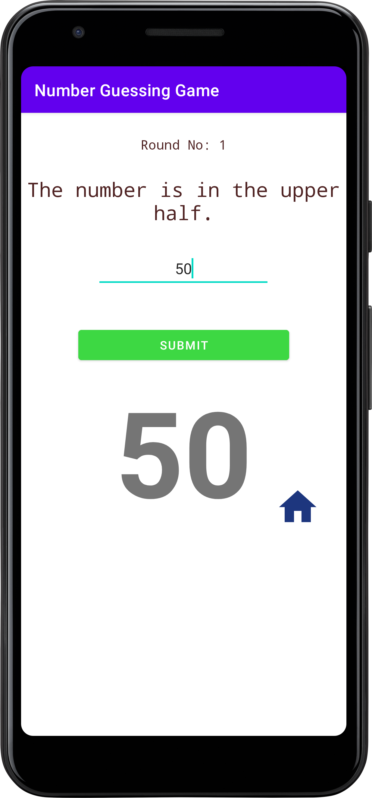
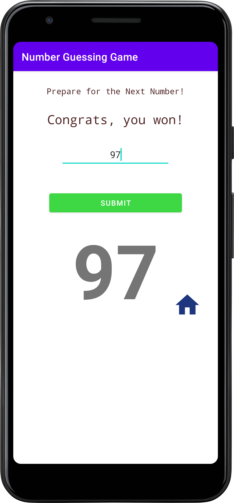

# Number Guessing Game Android App

This Android app is a simple number guessing game where the user tries to guess a randomly generated number based on hints provided after each round. The difficulty level can be chosen at the beginning of the game.

## Main Components

### `MainActivity.java`

The main activity where the number guessing game is played. It includes the following components:

- `TextView` for displaying the randomly generated number, hints, and round number.
- `EditText` for the user to input their guess.
- `Button` for submitting the guess.
- `ImageButton` for returning to the difficulty selection screen.
- Methods for playing turns, checking the user's guess, displaying hints, handling wins, playing again, and updating the UI.

### `Choosing_Difficulty.java`

An activity for selecting the difficulty level before starting the game. It includes buttons for Easy, Medium, and Hard difficulties.

## How to Play

1. Launch the app.
2. Choose the difficulty level (Easy, Medium, or Hard) by clicking on the corresponding button.
3. Enter your guess in the provided `EditText` field.
4. Click the "Submit" button to check your guess.
5. Receive hints after each round to guide you towards the correct number.
6. Win the game by guessing the correct number.
7. Click the home button to return to the difficulty selection screen.

## Game Logic

- The game generates a random number based on the selected difficulty.
- Hints are provided after each round, offering information about the position or range of the correct number.
- The game is won when the user guesses the correct number.
- After winning, the user can play again with a new randomly generated number.

## Screenshots

